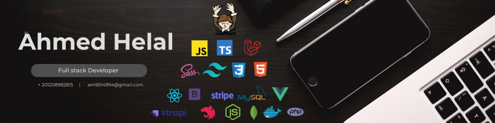

<h1 align="center">
    
</h1>

💻 Full-Stack Developer | Laravel & Vue.js Enthusiast | Problem Solver

I’m passionate about creating powerful web apps with clean code and elegant UI.  
I love combining backend logic with smooth frontend experiences.

---

### 🚀 Projects I'm Working On
- **ERP System** – Full-featured ERP with accounting, HR, and inventory modules.  
- **Booking App** – Restaurant and salon booking platform with Laravel + Vue.  
- **Affiliate Plugin** – Custom plugin for Botble CMS to manage commissions.

---

### 🧠 Skills & Tools
`Laravel` · `Vue.js` · `PHP` · `JavaScript` · `MySQL` · `REST APIs` · `Docker` · `Git`

---

### 📊 GitHub Stats

---

### 📫 Let's Connect
- 🌐 [Website](https://ahmedhelal909.github.io/My-Portfolio)  
- 💼 [LinkedIn](https://www.linkedin.com/in/ahmed-helal-66718a1ba)  
- 📧 **am9514994@gmail.com**

---

⭐️ *Thanks for visiting! Feel free to explore my projects below.*
